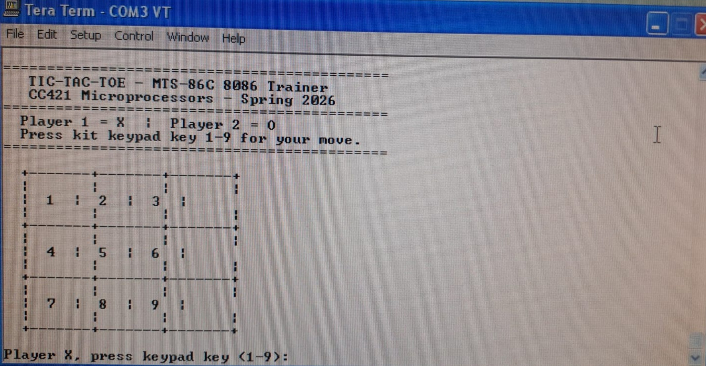
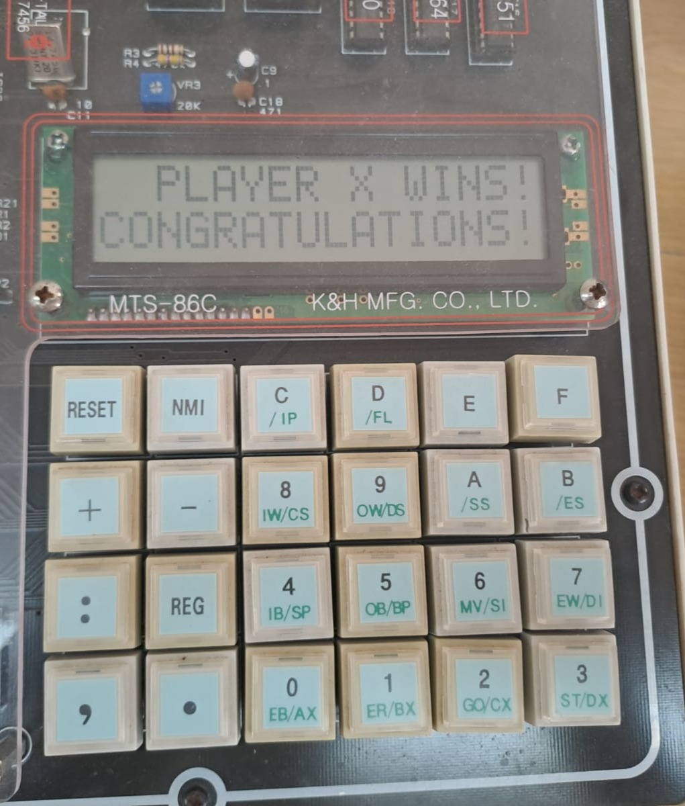

# ❌⭕ Tic-Tac-Toe — 8086 Assembly on MTS-86C Trainer Kit

> A fully functional two-player Tic-Tac-Toe game written in **8086 Assembly**, running on the **MTS-86C Microcomputer Trainer Kit** with real hardware I/O: keypad input, LCD messages, and LED win celebration.

[]()
[]()
[]()
[]()

---

## 📌 Overview

This project implements a complete two-player Tic-Tac-Toe game in pure 8086 Assembly language. It runs on the **MTS-86C 8086 Microcomputer Trainer Kit** and uses three real hardware peripherals simultaneously:

| Peripheral | Role |
|---|---|
| **8279 Keypad** | Player input (keys 1–9 mapped to board cells) |
| **RS-232 Terminal** (Tera Term) | Board display, prompts, and game messages |
| **HD44780 LCD** | Win/Draw announcement on the kit's LCD screen |
| **8255 Port B LEDs** | Rotating LED celebration on player win |

---

## 👥 Team

| Name | ID |
|---|---|
| Mohamed Yasser Samak | 24011107 |
| Elsayed Ashraf Bakry | 23010293 |
| Adham Khattab | 24010991 |

**Lecturer:** Dr. Nayera Sadek  
**Course:** CC 421 — Microprocessors Lab, Spring 2026

---

## 🎮 How to Play

The 3×3 board is numbered 1–9:

```
  +-------+-------+-------+
  |       |       |       |
  |   1   |   2   |   3   |
  |       |       |       |
  +-------+-------+-------+
  |       |       |       |
  |   4   |   5   |   6   |
  |       |       |       |
  +-------+-------+-------+
  |       |       |       |
  |   7   |   8   |   9   |
  |       |       |       |
  +-------+-------+-------+
```

- **Player 1** plays as `X`, **Player 2** plays as `O`
- Press the corresponding key on the kit keypad to place your symbol
- First player to get **3 in a row** (horizontal, vertical, or diagonal) wins
- If all 9 cells are filled with no winner, the game is a **Draw**
**Tera Terminal UI:**

---

## ⚙️ Hardware & I/O Map

| Peripheral | Address | Description |
|---|---|---|
| 8255-3 Control Register | `3FD6H` | PPI configuration (90H = Port B output) |
| 8255-3 Port B | `3FD2H` | 8 LEDs (LED celebration output) |
| 8279 Command/Status | `FFEAH` | Keypad controller — status polling |
| 8279 Data (FIFO) | `FFE8H` | Keypad controller — key read |
| LCD Data Write | `FFC5H` | Send character to LCD display RAM |
| LCD Status Read | `FFC3H` | Poll LCD Busy Flag (bit 7) |
| LCD Command Write | `FFC1H` | Send command byte to LCD controller |

---

## 🏗️ Program Flow

```
                    ┌─────────────────────┐
                    │      STARTUP        │
                    │  Init 8255 PPI      │
                    │  Clear LEDs         │
                    │  Print Welcome      │
                    └────────┬────────────┘
                             │
                    ┌────────▼────────────┐
                    │    MAIN LOOP        │◄──────────────┐
                    │  Draw Board         │               │
                    │  Print Prompt       │               │
                    └────────┬────────────┘               │
                             │                            │
                    ┌────────▼────────────┐               │
                    │    GET INPUT        │               │
                    │  Poll 8279 Keypad   │               │
                    │  Validate key 1–9   │               │
                    │  Echo to terminal   │               │
                    └────────┬────────────┘               │
                             │                            │
                    ┌────────▼────────────┐               │
                    │   PLACE MARK        │               │
                    │  Write X/O to GRID  │               │
                    │  Increment MOVES    │               │
                    └────────┬────────────┘               │
                             │                            │
               ┌─────────────┼─────────────┐             │
               ▼             ▼             ▼             │
          WIN?          DRAW?         CONTINUE           │
       (CHECK_WIN)    (MOVES=9)    Switch player ────────┘
            │               │
     ┌──────▼─────┐  ┌──────▼──────┐
     │  GAME_WIN  │  │  GAME_DRAW  │
     │ LCD msg    │  │ LCD msg     │
     │ LED rotate │  │ Exit prompt │
     └────────────┘  └─────────────┘
```
**Kit 8086 Interfacing:**


## 🧩 Subroutines

| Subroutine | Purpose |
|---|---|
| `DRAW_BOARD` | Prints the current 3×3 board to Tera Term, interleaving live `GRID[]` values with frame strings |
| `CHECK_WIN` | Checks all 8 winning lines (3 rows, 3 columns, 2 diagonals) for the current player. Returns `AL=1` on win |
| `LCD_WAIT` | Polls LCD status port bit 7 (Busy Flag) until the controller is ready |
| `LCD_CMD_WRITE` | Sends a command byte to the LCD (waits for ready first) |
| `LCD_DAT_WRITE` | Sends a character byte to LCD display RAM |
| `LCD_WIN_MSG` | Initialises LCD and writes `PLAYER X WINS` + `CONGRATULATIONS!` across 2 lines |
| `LCD_DRAW_MSG` | Initialises LCD and writes `** DRAW GAME!! **` + `WELL PLAYED!` across 2 lines |
| `HARDWARE_OUTPUT` | Rotates a single lit LED left across all 8 LEDs in an infinite loop (win celebration) |

---

## 💾 Data Segment

| Label | Size | Description |
|---|---|---|
| `GRID` | 9 bytes | Board cells — initialised `'1'`–`'9'`, overwritten with `'X'`/`'O'` on moves |
| `PLAYER` | 1 byte | Current player symbol (`'X'` starts first) |
| `MOVES` | 1 byte | Move counter (0–9); draw detected when it reaches 9 |
| `MSG_WELCOME` | string | Welcome banner printed at startup |
| `MSG_TOP/SEP/ROW` | strings | Board frame fragments interleaved with live cell values |
| `LCD_STR_*` | strings | Null-terminated strings written to LCD |

---

## 🚀 Running the Project

### Requirements
- MTS-86C 8086 Microcomputer Trainer Kit
- MASM or compatible 8086 assembler
- Tera Term (or any RS-232 terminal at the kit's baud rate)

### Steps

**1. Assemble the source file:**
```
MASM working_with_blinking.ASM;
LINK working_with_blinking.OBJ;
```

**2. Transfer the binary to the MTS-86C kit** via the kit's monitor upload utility.

**3. Execute from address `0000H`** using the kit monitor's `G` (Go) command:
```
G 0000
```

**4. Open Tera Term** connected to the kit's RS-232 port to see the board and interact.

> **Tip:** The keypad scan codes map as: key `1` → `00H`, key `2` → `01H`, ..., key `9` → `08H`. The program converts these to ASCII `'1'`–`'9'` internally.

---

## 🛠️ Key Implementation Details

**Keypad polling (non-blocking loop):**  
The program reads the 8279 Status Register at `FFEAH` and checks bit 0 (FIFO Data Available). It spins in `KBD_POLL` until a key is pressed, then reads the scan code from the Data Register at `FFE8H`.

**RAM/Storage layout:**  
All data is placed after the last `ENDP` directive in the same code segment (`CS = DS`). The stack is initialised to `4000H` to avoid overlapping the program and data area.

**LCD busy-wait:**  
Every LCD command and data write is preceded by a `LCD_WAIT` call that polls bit 7 of the LCD Status port. This ensures no bytes are dropped even when the LCD is processing a clear-display command (which takes ~1.5ms).

**LED rotation:**  
`HARDWARE_OUTPUT` uses `ROL AL, 1` to rotate a single set bit left through all 8 bits — producing the classic chasing-light effect — with a software delay loop between each step.

---

## 📝 Notes

- The program does **not** return to DOS after a win — it loops the LED animation forever. Reset the kit to restart.
- The `BLINK_COUNT` constant in the source is a legacy label kept for reference; the actual LED loop is controlled by `CX` inside `HARDWARE_OUTPUT`.
- Input validation rejects all keypad scan codes above `08H` with an `INVALID_INPUT` branch that re-prints the prompt.
